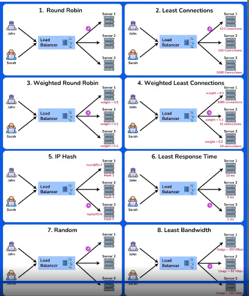

# Load Balancing

A **Load Balancer** is a networking device or software application that distributes incoming traffic among multiple servers to ensure:

* High availability
* Efficient server utilization
* Better performance

It works like a **traffic cop**, routing client requests across servers so no single server is overloaded.

---

## Why Load Balancing is Needed

Without a load balancer, several problems arise:


* **Single Point of Failure**: If one server goes down, the entire application becomes unavailable.
* **Overloaded Servers**: A single server can’t handle unlimited requests; high traffic leads to crashes.
* **Limited Scalability**: Adding more servers doesn’t automatically share the load.

Load balancers solve all these issues.


---

## Key Characteristics

* **Traffic Distribution**: Balances requests across multiple servers.
* **High Availability**: Redirects traffic if one server fails.
* **Scalability**: Supports horizontal scaling by adding servers easily.
* **Optimization**: Ensures efficient resource utilization.
* **Health Monitoring**: Checks server health and avoids unhealthy servers.
* **SSL Termination**: Handles SSL/TLS encryption to reduce server load.

---

## How Load Balancer Works

1. **Receives Incoming Requests** – All client requests go to the load balancer first.
2. **Checks Server Health** – Continuously monitors which servers are available.
3. **Distributes Traffic** – Sends requests to the best server based on load, response time, or proximity.
4. **Handles Server Failures** – Stops routing to failed servers and redirects to healthy ones.
5. **Optimizes Performance** – Reduces delays and bottlenecks by efficient distribution.
   

---

## Benefits

* **Better Performance** – No single server gets overloaded.
* **Scalability** – Works with auto-scaling during traffic spikes.
* **Failure Handling** – Detects unhealthy servers and redirects.
* **Prevents Bottlenecks** – Smooth handling of sudden spikes.
* **Efficient Resource Use** – All servers share the workload.
* **Session Persistence** – Maintains user sessions (important for shopping carts, etc.).

---

## Challenges

* **Single Point of Failure** – If the load balancer itself fails, traffic is disrupted (unless backup exists).
* **Cost and Complexity** – Professional solutions can be expensive.
* **Configuration Issues** – Tricky setup for complex apps.
* **Extra Overhead** – Adds slight delay as all traffic passes through it.
* **SSL Management** – Handling encryption at the balancer can complicate end-to-end security.

---

# Load Balancer Types

Load Balancers distribute incoming network traffic across multiple servers to ensure:



* Optimal resource utilization
* Minimum response time
* Prevention of server overload

There are multiple types of load balancers, which can be classified **based on configuration** and **based on function**.

---

## 1. Based on Configurations

These are categorized by how they are set up and managed in a system (hardware, software, or virtualized).

### Software Load Balancers

* Run on **general-purpose servers** as applications.
* Flexible and adaptable in different environments.
* **Cheapest option** to implement.
* If one server fails (after configurable retries), it switches to the next.
* Best suited for small to medium-scale setups.

### Hardware Load Balancers

* Physical appliances dedicated to distributing traffic.
* Also known as **Layer 4–7 Routers**.
* Handle HTTP, HTTPS, TCP, UDP traffic.
* High performance but **very expensive** and less flexible.
* Common use: As the first entry point, then hand off to internal software load balancers.

### Virtual Load Balancers

* Implemented as a **virtual machine (VM)** or software instance in a **virtualized environment** (e.g., VMware, Hyper-V, KVM).
* Distribute traffic across multiple servers/resources in cloud or data centers.
* Improve efficiency and response times while preventing overload.
* Often used in **cloud-based deployments**.

---

## 2. Based on Functions

These types are classified by the **layer of the OSI model** where they operate.

### Layer 4 (L4) – Network Load Balancer

* Operates at the **Transport Layer (TCP/UDP)**.
* Distributes traffic based on **IP addresses and port numbers**.
* **Fast and efficient** – doesn’t inspect packet content.
* Supports **basic NAT (Network Address Translation)**.

### Layer 7 (L7) – Application Load Balancer

* Operates at the **Application Layer (HTTP/HTTPS)**.
* Makes decisions based on **application content** (URLs, headers, cookies).
* Supports:

  * **Content-based routing**
  * **SSL termination**
  * **Advanced intelligent routing**

### Global Server Load Balancer (GSLB) / Multi-site Load Balancer

* Distributes traffic across **multiple data centers or geographic regions**.
* Considers:

  * **Server health**
  * **Geographic proximity**
  * **Latency**
* Provides **disaster recovery** and **high availability** globally.

---

# Load Balancing Algorithms

👉 **What is load balancing?**
When too many users access an application, we don’t want **one server overloaded** while others sit idle.
So, a **Load Balancer** decides which server will handle which request.

There are **two types of algorithms**:

1. **Static Load Balancing** → Predefined rules, no runtime adaptability.
2. **Dynamic Load Balancing** → Decisions made in real time based on server load/response.

---

##  Static Load Balancing

Rules are fixed. No matter what happens to servers, requests are distributed in a **predefined pattern**.

### 1. Round Robin
.webp)
* Requests go to servers one by one in rotation.
* Example: Candy distribution in a circle – everyone gets 1 candy before the cycle repeats.

✅ Best for **equal capacity servers**.

❌ Problem: Doesn’t care if a server is already overloaded.

**Code intuition**:

```cpp
currentIndex = (currentIndex + 1) % servers.size();
```

This ensures servers are chosen cyclically.

---

### 2. Weighted Round Robin
.webp)

* Same as round robin, but **servers have weights (capacity)**.
* A stronger server (higher CPU/RAM) gets **more requests**.

✅ Best when servers have **different capacities**.

❌ Problem: Must update weights if server performance changes.

**Code intuition**:

* Total weight = sum of server weights.
* Random number picked → decides server based on weight proportion.

---

### 3. Source IP Hash
.webp)

* Requests are routed based on the **hash of client’s IP**.
* Same client always goes to the same server → good for **session persistence**.

✅ Best for apps needing **sticky sessions** (e.g., banking, shopping carts).
❌ Uneven traffic if many users share the same IP (like from one company).

**Code intuition**:

```cpp
size_t hash = std::hash<std::string>{}(sourceIp);
serverIndex = hash % servers.size();
```

This ensures the same IP always maps to the same server.

---

##  Dynamic Load Balancing
Here, the load balancer checks **real-time server performance**.)

### 1. Least Connections
.webp)
* Pick the server with the **fewest active connections**.
* Like choosing the swing with the least kids on it.

✅ Best for apps where connections last long (e.g., video streaming).

❌ Doesn’t consider server capacity.

**Code intuition**:

```cpp
if (entry.second < minConnections) {
    selectedServer = entry.first;
}
```

Always picks server with minimum active connections.

---

### 2. Least Response Time
.webp)
* Routes requests to the **fastest responding server**.
* Like choosing the quickest food counter.

✅ Best for apps where response time is critical (APIs, e-commerce).

❌ Needs continuous monitoring of response times.

**Code intuition**:

```cpp
if (entry.second < minResponseTime) {
    selectedServer = entry.first;
}
```

Always picks server with the lowest response time.

---

# When to Use Which?

* **Round Robin** → Equal servers, simple web apps.
* **Weighted Round Robin** → Different server capacities.
* **Source IP Hash** → Session persistence needed.
* **Least Connections** → Long-living connections (video, chat).
* **Least Response Time** → Performance-critical systems.

---

⚡ So in short:

* **Static** = Fixed distribution (fair but not adaptive).
* **Dynamic** = Smarter (adapts to live server status).

---

# How a Load Balancer Works

Think of a **load balancer** like a **traffic police officer** at a busy junction 🚦.
Cars (client requests) are coming in fast, and the officer directs them to the right lanes (servers) so no single lane is jammed.


---

## Steps in Load Balancer Working

### 1. **Distribution of Incoming Requests**

* Client request (like opening Amazon.com) first goes to the **Load Balancer**.
* LB chooses a **backend server** (physical, VM, or container) using an **algorithm**.
* This prevents one server from being overloaded while others are idle.

👉 Example: 10,000 users hit your app → LB spreads them over 5 servers (2000 each).

---

### 2. **Health Checking**

* LB **continuously checks if servers are healthy**.
* If one crashes, LB **stops sending traffic** to it.
* This improves **reliability and fault tolerance**.

👉 Example: If server-2 is down, LB routes requests only to servers 1, 3, 4, 5.

---

### 3. **Load Balancing Algorithms**

* Algorithms decide **who gets the next request**:

  * **Round Robin** → equal distribution (good for similar servers).
  * **Least Connections** → server with fewest active users gets request.
  * **IP Hash** → same client IP always mapped to the same server (session persistence).

👉 Example: If you log in to a shopping site, IP Hash ensures your cart stays on the same server.

---

### 4. **Session Persistence (Sticky Sessions)**

* Some apps (like banking, shopping cart, gaming) store **session info locally**.
* LB ensures requests from the **same client always go to the same server**.

👉 Without this → your cart items may disappear because you land on a different server.

---

### 5. **Scalability & High Availability**

* LB helps with **horizontal scaling**:

  * Add more servers → LB automatically distributes load.
  * Removes unhealthy servers → still keeps app running.

👉 That’s how Netflix handles traffic spikes when a new show releases 🎬.

---

### 6. **SSL Termination**

* Normally, servers must **encrypt & decrypt HTTPS traffic** (CPU heavy).
* LB can take this job → **offloads SSL/TLS encryption**.
* Backend servers get plain HTTP requests → faster response.

👉 Example: Instead of 100 servers doing encryption, the LB does it once.

---

# Quick Revision

| Step                       | What It Does                      | Why Important          |
| -------------------------- | --------------------------------- | ---------------------- |
| **1. Distribution**        | Routes client requests to servers | Prevents overload      |
| **2. Health Check**        | Monitors server health            | Fault tolerance        |
| **3. Algorithms**          | Round Robin, Least Conn, IP Hash  | Efficient traffic mgmt |
| **4. Session Persistence** | Same user → same server           | Session consistency    |
| **5. Scalability**         | Add/remove servers easily         | Handles traffic spikes |
| **6. SSL Termination**     | LB handles HTTPS encryption       | Improves performance   |

---

✅ In short:
A **Load Balancer = traffic cop + health monitor + smart router + security guard**.


# **Load Balancing Algorithms**

Load balancing ensures no single server is overloaded by distributing incoming requests intelligently.

* **Static Load Balancing**: Predefined assignment, doesn’t adapt at runtime.
* **Dynamic Load Balancing**: Adapts based on real-time server conditions.

---

## **1️⃣ Static Load Balancing Algorithms**

### **1.1 Round Robin Load Balancing**

**Logic:**

* Requests are assigned sequentially to servers in a circular manner.
* Simple, fair distribution but ignores server capacity.

**Use case:**

* All servers have similar capacity and performance.

**C++ Implementation:**

```cpp
#include <iostream>
#include <vector>
#include <string>

class LoadBalancer {
private:
    std::vector<std::string> servers; // List of servers
    int currentIndex;                 // Index of next server

public:
    LoadBalancer(std::vector<std::string> servers) : servers(servers), currentIndex(0) {}

    // Returns next server in round-robin manner
    std::string getNextServer() {
        std::string nextServer = servers[currentIndex];
        currentIndex = (currentIndex + 1) % servers.size();
        return nextServer;
    }
};

int main() {
    std::vector<std::string> serverList = {"Server1", "Server2", "Server3"};
    LoadBalancer loadBalancer(serverList);

    for (int i = 0; i < 10; i++) {
        std::cout << "Request " << (i + 1) << " routed to " << loadBalancer.getNextServer() << std::endl;
    }
    return 0;
}
```

---

### **1.2 Weighted Round Robin Load Balancing**

**Logic:**

* Each server has a **weight**.
* Servers with higher weights handle more requests.

**Use case:**

* Servers have different capacities.

**C++ Implementation:**

```cpp
#include <iostream>
#include <vector>
#include <cstdlib>
#include <ctime>

class Server {
public:
    std::string name;
    int weight;
    Server(std::string name, int weight) : name(name), weight(weight) {}
};

class WeightedRoundRobinBalancer {
private:
    std::vector<Server> servers;
    std::vector<int> cumulativeWeights;
    int totalWeight;

public:
    WeightedRoundRobinBalancer(std::vector<Server> servers) {
        this->servers = servers;
        totalWeight = 0;
        cumulativeWeights.resize(servers.size());
        for (size_t i = 0; i < servers.size(); i++) {
            totalWeight += servers[i].weight;
            cumulativeWeights[i] = totalWeight;
        }
        srand(time(0));
    }

    Server getNextServer() {
        int randomValue = rand() % totalWeight;
        for (size_t i = 0; i < cumulativeWeights.size(); i++) {
            if (randomValue < cumulativeWeights[i]) return servers[i];
        }
        return servers[0]; // fallback
    }
};

int main() {
    std::vector<Server> serverList = {
        Server("Server1", 3),
        Server("Server2", 2),
        Server("Server3", 1)
    };

    WeightedRoundRobinBalancer balancer(serverList);

    for (int i = 0; i < 10; i++) {
        Server s = balancer.getNextServer();
        std::cout << "Request " << (i + 1) << " routed to " << s.name << std::endl;
    }
    return 0;
}
```

---

### **1.3 Source IP Hash Load Balancing**

**Logic:**

* Hash the **source IP** to consistently route the same client to the same server.

**Use case:**

* Session persistence is required.

**C++ Implementation:**

```cpp
#include <iostream>
#include <unordered_map>
#include <vector>
#include <string>

class SourceIpHashLoadBalancer {
private:
    std::vector<std::string> servers;

public:
    void addServer(const std::string& serverName) {
        servers.push_back(serverName);
    }

    std::string getServerForIp(const std::string& sourceIp) {
        size_t hash = std::hash<std::string>{}(sourceIp);
        return servers[hash % servers.size()];
    }
};

int main() {
    SourceIpHashLoadBalancer lb;
    lb.addServer("Server1");
    lb.addServer("Server2");
    lb.addServer("Server3");

    std::vector<std::string> sourceIps = {"192.168.1.1", "10.0.0.1", "172.16.0.1"};
    for (auto ip : sourceIps) {
        std::cout << "Request from " << ip << " routed to " << lb.getServerForIp(ip) << std::endl;
    }
    return 0;
}
```

---

## **2️⃣ Dynamic Load Balancing Algorithms**

### **2.1 Least Connection Method**

**Logic:**

* Assign requests to the server with the fewest **active connections**.

**Use case:**

* Traffic varies, some requests are long-running.

**C++ Implementation:**

```cpp
#include <iostream>
#include <map>
#include <limits>
#include <string>

class LeastConnectionLoadBalancer {
private:
    std::map<std::string, int> serverConnections;

public:
    void addServer(const std::string& serverName) { serverConnections[serverName] = 0; }

    std::string getServerWithLeastConnections() {
        int minConnections = std::numeric_limits<int>::max();
        std::string selectedServer;
        for (auto &entry : serverConnections) {
            if (entry.second < minConnections) {
                minConnections = entry.second;
                selectedServer = entry.first;
            }
        }
        serverConnections[selectedServer]++;
        return selectedServer;
    }
};

int main() {
    LeastConnectionLoadBalancer lb;
    lb.addServer("Server1");
    lb.addServer("Server2");
    lb.addServer("Server3");

    for (int i = 0; i < 10; i++)
        std::cout << "Request " << i+1 << " routed to " << lb.getServerWithLeastConnections() << std::endl;

    return 0;
}
```

---

### **2.2 Least Response Time Method**

**Logic:**

* Assign requests to the server with the lowest **response time**.

**Use case:**

* Optimize for faster responses in high-traffic apps.

**C++ Implementation:**

```cpp
#include <iostream>
#include <map>
#include <limits>
#include <string>

class LeastResponseLoadBalancer {
private:
    std::map<std::string, long long> serverResponseTimes;

public:
    void addServer(const std::string& serverName) { serverResponseTimes[serverName] = 0; }

    std::string getServerWithLeastResponseTime() {
        long long minTime = std::numeric_limits<long long>::max();
        std::string selectedServer;
        for (auto &entry : serverResponseTimes) {
            if (entry.second < minTime) {
                minTime = entry.second;
                selectedServer = entry.first;
            }
        }
        serverResponseTimes[selectedServer]++;
        return selectedServer;
    }
};

int main() {
    LeastResponseLoadBalancer lb;
    lb.addServer("Server1");
    lb.addServer("Server2");
    lb.addServer("Server3");

    for (int i = 0; i < 10; i++)
        std::cout << "Request " << i+1 << " routed to " << lb.getServerWithLeastResponseTime() << std::endl;

    return 0;
}
```

---

### **2.3 Resource-Based Load Balancing**

**Logic:**

* Assign requests based on **real-time resources** (CPU, memory, bandwidth).
* Choose the server with the **most available resources**.

**Use case:**

* CPU/memory-intensive applications.

**C++ Implementation:**

```cpp
#include <iostream>
#include <map>
#include <limits>
#include <string>

class Server {
public:
    std::string name;
    double cpuLoad;
    Server(std::string name) : name(name), cpuLoad(0.0) {}
    void updateCpuLoad(double load) { cpuLoad = load; }
};

class ResourceBasedLoadBalancer {
private:
    std::map<std::string, Server> servers;

public:
    void addServer(Server s) { servers[s.name] = s; }

    Server getServerWithMostResources() {
        Server bestServer("");
        double lowestLoad = std::numeric_limits<double>::max();
        for (auto &pair : servers) {
            if (pair.second.cpuLoad < lowestLoad) {
                lowestLoad = pair.second.cpuLoad;
                bestServer = pair.second;
            }
        }
        return bestServer;
    }

    void handleRequest() {
        Server s = getServerWithMostResources();
        std::cout << "Routing request to server: " << s.name << " with CPU load: " << s.cpuLoad << "%\n";
    }
};

int main() {
    ResourceBasedLoadBalancer lb;
    Server s1("Server1"), s2("Server2"), s3("Server3");

    s1.updateCpuLoad(30.0);
    s2.updateCpuLoad(50.0);
    s3.updateCpuLoad(20.0);

    lb.addServer(s1);
    lb.addServer(s2);
    lb.addServer(s3);

    lb.handleRequest(); // Should route to Server3
    return 0;
}
```

---

✅ **Summary Table**

| Type    | Algorithm            | Key Feature                      | When to Use                   |
| ------- | -------------------- | -------------------------------- | ----------------------------- |
| Static  | Round Robin          | Equal sequential distribution    | Equal capacity servers        |
| Static  | Weighted Round Robin | Servers get load based on weight | Unequal server capacities     |
| Static  | Source IP Hash       | Routes same IP to same server    | Session persistence           |
| Dynamic | Least Connections    | Fewest active connections        | Variable connection durations |
| Dynamic | Least Response Time  | Fastest responding server        | High-performance apps         |
| Dynamic | Resource-Based       | Most available resources         | CPU/memory-intensive tasks    |

